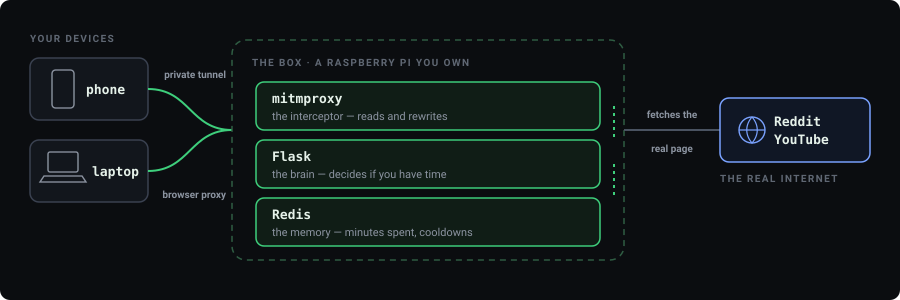
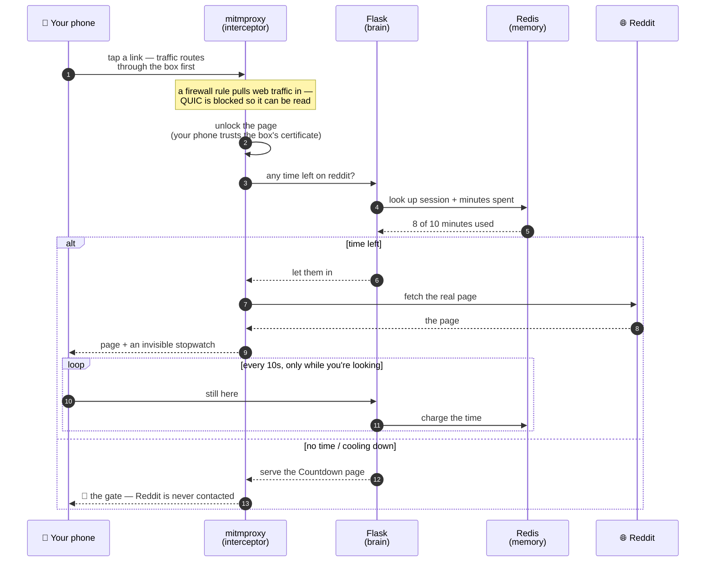
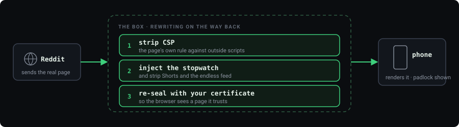

# How Cooldown Works — a field guide

A tour of the whole machine: what each part does and how a single tap on a Reddit
link becomes a countdown. Each idea is **plain terms first**, then **under the
hood** for the curious.

> 🧭 **Never seen this stuff before?** Start with [**CONCEPTS.md**](CONCEPTS.md) — it
> explains proxies, certificates, DNS and the rest from scratch, no background assumed.
> There's also a quick [glossary](#glossary) at the bottom of this page.
>
> 👀 **Want to see it actually happen?** Jump to
> [Watch one real request, step by step](#watch-one-real-request-step-by-step) — a single
> tap followed all the way through, with the real data at each stage.

---

## The idea

**The problem:** feeds are engineered to erase your sense of time. Willpower loses;
a hard "blocked" wall just gets ripped out in frustration.

**The bet:** the enemy isn't *total* time — it's the unbroken 45-minute trance. So
Cooldown gives you a small budget of *foreground* time on the tempting sites, then
makes you take a break. **The pause is the whole point.**

> *Under the hood:* the tool has to know when you're actually **looking** at the
> page (not just that traffic flowed), count that time, and swap the site for a
> "Countdown" page when the budget is spent. Doing that needs a box that can see
> inside your traffic — which is the rest of this guide.

---

## The big picture

Everything routes through one small computer you own, between your devices and the
internet:



Three small programs run on the box, easiest to remember by their **jobs**:

- **The interceptor** — reads and rewrites your traffic
- **The brain** — holds the budget rules
- **The memory** — remembers how much time you've spent

---

## The journey of a tap

What actually happens, start to finish, when you open a Reddit link — the heart of it:



Step by step:

1. **You tap a Reddit link.** Your phone's internet travels through the box first.
   *(The phone routes via the box — a private tunnel that works on Wi-Fi and cellular.)*
2. **The box grabs the web traffic.** A firewall rule redirects all web traffic into
   the interceptor.
   *(iptables redirects ports 80/443 → mitmproxy; the faster "QUIC" protocol is
   blocked so the browser falls back to one the box can read.)*
3. **The interceptor unlocks the page.** Because your phone trusts the box's
   certificate, the box can read the encrypted page — the only reason this is possible.
   *(mitmproxy terminates the TLS using its own trusted CA certificate.)*
4. **It asks the brain: any time left?** Checks the memory for an active session and
   remaining budget for this site.
   *(Looks up session + spent time in Redis, via the Flask logic.)*
5. **Decision: gate, or let you in.** No time / cooldown → show the "Countdown" page.
   Time left → let the real page load, but slip in a tiny invisible script first.
   *(Serves the budget page, OR injects the heartbeat script and passes the page through.)*
6. **The clock ticks while you look.** The injected script pings the box every few
   seconds — but only while the tab is on screen. Each ping spends a little budget.
   Spend it all and the gate returns, starting a cooldown.
   *(Visibility-gated heartbeat → server subtracts elapsed time → cooldown at zero.)*

---

## …and the trip back

Reaching the site was only half the round trip — the most interesting rewriting
happens on the way **back** to you.



The page your phone shows is **not quite** the one the site sent — de-clawed (Shorts
and the endless feed removed) and wired with the timer, all invisibly. Your browser
can't tell: it arrives sealed with a certificate the phone already trusts.

> *Under the hood:* mitmproxy's response hooks run on the return trip —
> `responseheaders` deletes the site's `Content-Security-Policy` (which normally
> forbids injected code), then the `response` hook splices in the heartbeat script
> and the YouTube declutter. mitmproxy re-encrypts with its own certificate, so the
> browser renders it as if it came straight from the site.

From then on the loop runs itself: the injected heartbeat makes its **own** requests
back to the box every few seconds — tunnel → redirect → proxy → brain → memory — so
the box keeps the clock honest without you lifting a finger.

---

## Watch one real request, step by step

The story above, but with the actual data. You tap a Reddit link at **3:47 pm**. You've
already used 8 of your 10 minutes today.

### Step 0 · Your phone asks "where is reddit.com?"

Before any page can load, your phone looks up the address. This lookup is **not sealed** —
it goes out in readable text:

```
DNS query   →   "A?  www.reddit.com"          ← anyone in between can read this
DNS reply   ←   "www.reddit.com = 151.101.1.140"
```

> This is why the gate's background paints DNS in **red**. It's genuinely exposed. Nothing
> Cooldown does causes that; it's how the internet has always worked.

### Step 1 · The request leaves your phone — sealed

Your phone builds a request. In plain form it would read:

```http
GET /r/programming HTTP/2
Host: www.reddit.com
Cookie: session=8f3c…
```

But it's sealed with HTTPS first, so what actually travels the wire is gibberish:

```
17 03 03 04 a1  9d 6c 3f e2  b8 04 77 1c  aa 5f 90 c3  …
```

**Nobody can read that** — not your café's wifi, not your ISP. This is also exactly what
the gate's background shows in **green**: real encrypted traffic looks like nothing at all.

### Step 2 · The box grabs it

Because your phone routes through the box, those bytes arrive there. A firewall rule
shoves anything headed for a web port into the interceptor instead of letting it pass:

```
packet for 151.101.1.140:443
        │
        │  iptables:  -j REDIRECT --to-ports 8080
        ▼
    mitmproxy (listening on 8080)
```

*(QUIC — a faster protocol the box can't read — is blocked, so your phone falls back to
the interceptable one.)*

### Step 3 · The box opens the envelope

Here's the moment the whole design rests on. The box presents a certificate saying
"I'm www.reddit.com," signed by **the certificate authority you installed**. Your phone
checks its trusted list, finds it, and accepts.

So the gibberish becomes readable — *to your box, on your own traffic*:

```http
GET /r/programming HTTP/2
Host: www.reddit.com
```

> **This is the trade.** That capability is the entire reason Cooldown can work — and the
> entire reason [SECURITY.md](SECURITY.md) matters. The box can read *anything* from a
> device that trusts it, not just Reddit.

### Step 4 · The decision

Now the box knows the request is for Reddit, so it asks the brain:

```
  host = "www.reddit.com"     → a budgeted site? ................ yes
  Redis: active session?       → yes
  Redis: spent:main            → 487 seconds  (8 min 07 s)
  Reddit's cap                 → 600 seconds  (10 min)
  → 113 seconds left. Let it through.
```

Two ways this goes:

| Time left | What the box does |
|---|---|
| **Yes** (our case) | Fetch the real page, but modify it on the way back — Step 5 |
| **No** | Never fetch Reddit at all. Return the Countdown page instead, at the same URL |

That second row is worth noticing: when you're out of time, **your phone never reaches
Reddit**. The box answers in its place.

### Step 5 · The page is rewritten on the way back

Reddit's real page comes back to the box. Two edits happen before you see it:

```diff
  <html>
    <head>
-     Content-Security-Policy: script-src 'self'      ← removed
    </head>
    <body>
      …the actual Reddit page, untouched…
+     <script>                                        ← added
+       // ping the box every 10s, but ONLY while this tab is visible
+       setInterval(ping, 10000);
+       document.addEventListener("visibilitychange", …);
+     </script>
    </body>
  </html>
```

The first edit removes the site's rule forbidding outside scripts (otherwise the browser
would refuse the second edit). The second adds the stopwatch.

Then the box **reseals** the modified page with its certificate and sends it on. Your
phone renders it with a padlock, none the wiser.

### Step 6 · The clock runs — only while you look

Every 10 seconds, that script sends a tiny ping:

```
phone → box:   POST /budget/heartbeat?site=reddit
box   → phone: {"status":"ok","remaining":103}      ← 10 seconds charged
```

Switch apps or lock your phone and the pings **stop**, so the clock stops. This is why a
tab forgotten in the background costs you nothing.

### Step 7 · Zero

At `remaining: 0` the box answers the next heartbeat differently:

```
box → phone:   403 Forbidden   {"status":"blocked"}
```

The script sees it and reloads the page — so the Countdown appears **mid-scroll**, within
about ten seconds, without you clicking anything. A cooldown starts, and until it expires
every Reddit request gets the gate instead of Reddit.

### The whole trip on one line

```
tap → DNS (red, readable) → sealed bytes → box → firewall redirect → mitmproxy
    → opened with YOUR certificate → "is there time?" → Redis says yes
    → fetch real page → strip CSP + inject stopwatch → reseal → your screen
    → ping, ping, ping (only while visible) → zero → gate
```

---

## The stack — what runs where

Everything lives on one Raspberry Pi, in layers — the anatomy of the box:

| Layer | What it is | What it does |
|---|---|---|
| **Tailscale** | private mesh network | the tunnel your devices arrive through |
| **iptables** | firewall rules | shoves web traffic into the interceptor, blocks QUIC |
| **mitmproxy** + `addon.py` | the interceptor | decrypt · strip CSP · inject the stopwatch · serve the gate |
| **Flask** + `app.py` | the brain | the time rules, and every page you see |
| **Redis** | the memory | spent · cooldowns · sessions · history |

Each sits on the one below it: traffic enters through Tailscale, gets diverted by
iptables into mitmproxy, which asks Flask, which reads and writes Redis.

**Who talks to whom** — everything but the proxy is localhost-only:

```
  Browser ──▶ mitmproxy ──▶ Flask ──▶ Redis
   (tunnel)   :8080/:8081    :5000     :6379
                            localhost  localhost
```

Only the interceptor faces the network (and it's locked to Tailscale). The brain
and memory listen on localhost only — nothing off the box can reach them.

### Each part, in depth

| Part | Job | Where it lives · listens · talks to |
|---|---|---|
| **Interceptor** — mitmproxy | Reads each page; serves the gate or injects the timer. The only part facing the network. Decrypts HTTPS, strips CSP, injects the heartbeat, removes YouTube Shorts + feed. | `addon.py` · service `cooldown-proxy` · listens `:8080` (transparent) + `:8081` (regular) · → Flask `:5000` |
| **Brain** — Flask | Owns all the rules: budget size, cooldowns, night mode, refills. Serves the gate/stats pages and `/heartbeat`, `/enter`. | `app.py` · service `cooldown-app` · listens `:5000` (localhost) · → Redis `:6379` · run by the waitress WSGI server |
| **Memory** — Redis | Remembers spent time, cooldowns, usage history (keys like `spent:main`, `cooldown:main`). | service `redis-server` · listens `:6379` (localhost) · persists via an append-only file on disk |

---

## Where it can run — three shapes

Everything above describes the reference box, a Raspberry Pi. But the **same code**
runs in three shapes. The only thing that changes is *how your traffic reaches the
interceptor* — and that one choice decides what can be gated.

**Tab on screen:** the injected script pings the box every 10 seconds, and each ping
spends a little budget.

**Tab hidden, or phone locked:** the pings stop, nothing reaches the box, and the
budget is untouched. A forgotten tab costs you nothing.

- **1 · The Raspberry Pi** — the always-on reference. The phone routes through it over
  Tailscale and its traffic is transparently redirected into mitmproxy. Gates phone +
  laptop, anywhere (even cellular).
  *How:* transparent redirect + Tailscale exit node. *Needs:* a dedicated, always-on
  Pi. → [SETUP.md](SETUP.md)
- **2 · Docker on your computer** — the try-it onramp. `docker compose up`, point a
  browser at the proxy (`:8080`), install the CA. Gates that computer's browser only —
  a container is great at "listen on a port" but can't reach a phone.
  *How:* explicit proxy. *Needs:* just Docker. → [DOCKER.md](DOCKER.md)
- **3 · Docker + Tailscale** — gate a *phone* from a computer, no Pi. The container
  runs Tailscale itself as your phone's exit node, so the phone's traffic arrives
  **inside the container's own network namespace** — right where the iptables redirect
  and transparent mode live. Because Tailscale is an *overlay* (it rides the container's
  normal outbound internet), it sidesteps the "a container can't see the host network"
  wall — including the hidden Linux VM on Mac/Windows — because it never touches the
  host network. The catch: a privileged container, and the gate only holds while your
  computer is awake, which is why a Pi is the better home.
  *How:* exit node → transparent, all inside the container. *Needs:* Docker + a
  Tailscale key. → [DOCKER-PHONE.md](DOCKER-PHONE.md)

---

## The clever bits

### 1 · Charging only the time you're actually looking

| | Hours | What the budget does |
|---|---|---|
| ☀️ **Day** | 7am → 10pm | full budget; refills slowly while you're away |
| 🌇 **Wind-down** | 10pm → 11pm | the cap shrinks on a ramp toward the night floor |
| 🌙 **Night** | 11pm → 7am | one small buffer, then closed |

At 7am everything resets and the day starts over.

This is what makes the budget honest. A crude tool charges you for *traffic*;
Cooldown charges you for **attention**, using the browser's own "is this tab
visible?" signal.

### 2 · One shared bucket, with a cooldown wall

- **Shared bucket** — all sites draw from it, with per-site caps (Reddit 10m, YouTube 15m).
- **Drain it completely** → a hard 1-hour cooldown.
- **Step away** → it slowly refills, but only after a grace period, so you can't
  "sip" by waiting a minute.

> *Under the hood:* a refill credits the bucket at a slow rate once you've been idle
> past a grace window; a full drain sets `cooldown:main` and the hard wall. It's a
> small state machine, pinned by 56 tests.

### 3 · A day that winds down to bedtime

**Explicit** — the traffic volunteers. You set the browser's proxy setting, so it
knowingly sends everything to the interceptor. Gates that browser only.

**Transparent** — the traffic is diverted. Routing plus iptables send it to the
interceptor without the device being asked. Gates the whole device, including apps.

Deliberately **soft** — a wind-down and a small (independent, non-refilling) night
buffer rather than a hard lockout, so it never tempts you to switch the whole thing
off. A separate **Study mode** (locked to a course playlist) stays open at all hours
— the productive escape hatch.

---

## Why it's built this way

- **A VPN tunnel, not a DNS blocker.** Routing every packet gives request-level
  control — read paths, inject scripts, work on cellular. DNS only sees domain names.
- **The mobile browser, not the apps.** Native apps pin their certificates and can't
  be intercepted; browsers can. The app being ungateable is *why* the plan is to
  remove it.
- **A Pi at home, not the cloud.** You own the box and the data, no subscription, and
  the certificate that can read your traffic never leaves your house.
- **Soft friction, not a hard lock.** A wall you can't pass gets torn down; a pause
  you respect survives. Every "no" degrades gently and leaves an escape hatch.

---

## Glossary

| Term | In plain language |
|---|---|
| **Proxy** | A middleman your traffic passes through; it can inspect or change what flows by. |
| **MITM** | *Man-in-the-middle* — sitting between two parties reading/altering their conversation. Malicious when done *to* you; here **you** do it to your own traffic, on purpose. |
| **HTTPS / TLS** | The lock icon. TLS scrambles web traffic so only the two ends can read it — which is why the box needs a trick to see inside. |
| **Certificate / CA** | A *Certificate Authority* vouches for who a site is. If your phone trusts the box's CA, it accepts the box's stand-in certificate — letting it decrypt your pages. The tool's superpower and biggest responsibility. |
| **VPN** | *Virtual Private Network* — an encrypted tunnel carrying your traffic elsewhere first (here, to the box). |
| **WireGuard / Tailscale** | WireGuard is the modern VPN tech; Tailscale is the easy tool built on it that connects your devices to the box, even over cellular. |
| **Exit node** | The device a VPN sends your internet *out* through. The box is your exit node. |
| **mitmproxy** | The software that intercepts, decrypts, and rewrites pages. |
| **Flask** | A small Python web framework — the "brain." |
| **Redis** | A fast in-memory database — the "memory." |
| **iptables** | Linux's built-in firewall/routing; steers web traffic into the interceptor and blocks what it can't read. |
| **Port** | A numbered "door" on a computer — programs listen on different ports so traffic reaches the right one (mitmproxy 8080/8081, Flask 5000, Redis 6379). |
| **localhost** | The machine talking to *itself*. Flask and Redis only accept localhost connections, so nothing off the box can reach them. |
| **systemd** | Linux's service manager — keeps the three programs running and restarts them on boot (why they're "services"). |
| **WSGI / waitress** | The plumbing that lets a Python web app (Flask) receive real requests; **waitress** is the production-grade version used here. |
| **QUIC** | A newer, faster web transport (used heavily by YouTube); blocked so browsers fall back to the inspectable kind. |
| **Heartbeat** | The tiny injected script that pings the box every few seconds *while the tab is visible*. |
| **Session / cooldown** | A *session* is an active "you're allowed in" pass; a *cooldown* is the enforced break once the budget is spent. |

---

*See also: [README](README.md) · [SETUP](SETUP.md) · [SECURITY](SECURITY.md) · [SECURITY-CASESTUDY](SECURITY-CASESTUDY.md)*
