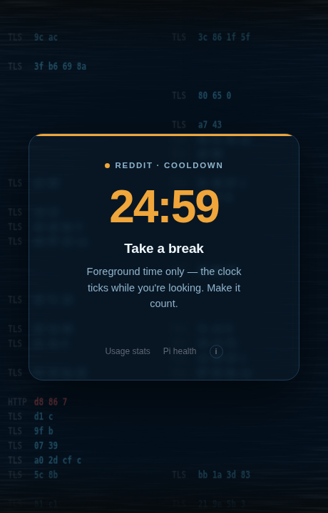
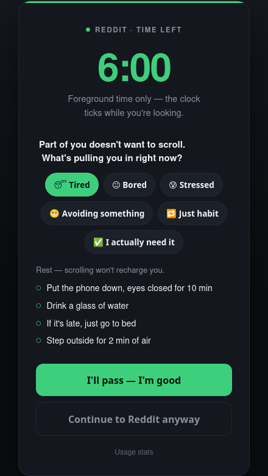
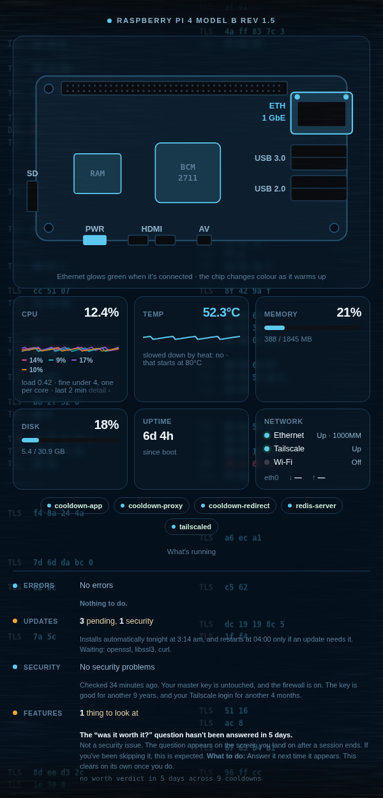
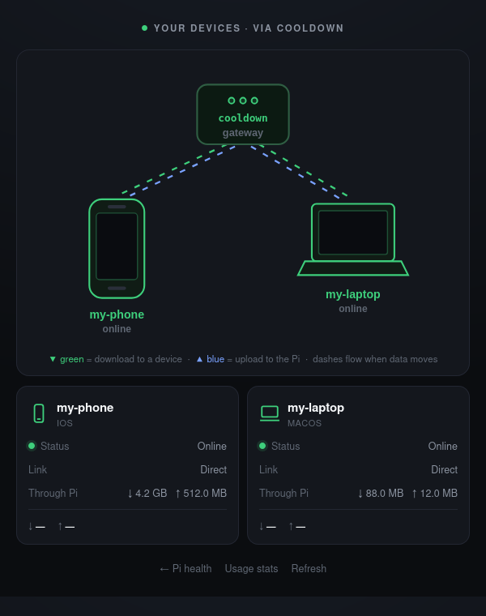

# Cooldown

### Doomscroll killer

**A self-hosted anti-doomscroll gateway. It budgets your *foreground time* on the
sites that eat your attention, then forces a cooldown — a pause to break the
trance, not a wall that makes you rip the whole thing out.**

Cooldown runs on a small box you own (a Raspberry Pi is the reference target). Your
phone and laptop route through it, and for the sites you choose — Reddit, YouTube,
etc. — it meters the minutes you actually *look at the screen* and, when the budget
is spent, shows a calm "Countdown" page instead of the feed.

> ### ⚠️ Read this before you install anything
>
> To do its job, Cooldown **reads your own internet traffic**. That means giving your
> phone and laptop a permission they don't normally give anything: *trust this box
> completely.* It's a reasonable trade when the box is yours — but it's a real one, and
> you should understand it first.
>
> **[SECURITY.md](SECURITY.md) explains exactly what that means, in plain language.**
> Five minutes, no jargon. It's the one page not to skip.
>
> The short version: you create your own "master key" on your box and nowhere else. This
> repo ships none, and **you should never install one that anybody hands you.**

**New to any of this?** [**CONCEPTS.md**](CONCEPTS.md) explains every term the docs use —
proxy, certificate, exit node, DNS — in plain English, with no assumed background.

---

## Screenshots

<table>
  <tr>
    <td width="50%"><br><sub><b>The cooldown.</b> When a session's up, a calm countdown — not a wall — with a free Study escape hatch.</sub></td>
    <td width="50%"><br><sub><b>A pause before you dive in.</b> Name why you're reaching for it and get a better option — Continue is always one tap away.</sub></td>
  </tr>
  <tr>
    <td width="50%"><br><sub><b>Pi health.</b> A live line-art board — the ethernet port glows green, the SoC tints with temperature.</sub></td>
    <td width="50%"><br><sub><b>Your devices.</b> Phone + laptop over Tailscale, lanes flowing (and thickening) with live traffic.</sub></td>
  </tr>
</table>

> All screenshots use mock data — the pages are private and reachable only through your own box.

---

## Why it's different

Most screen-time tools **block** (on/off) or enforce a **daily cap**. Cooldown's bet
is that *total* time isn't the enemy — the unbroken 45-minute binge is. So instead
of blocking, it:

- **Charges foreground time only.** An injected, visibility-gated heartbeat means
  time counts *while you're looking*. Background tabs and locked screens are free.
- **Forces a cooldown after a session,** to break the scroll trance — then lets you
  back in. The pause is the point.
- **Does surgery, not just blocking.** On YouTube it strips Shorts, the home feed,
  and autoplay while leaving Search and Subscriptions — so the tool removes the
  slot machine without removing the utility.
- **Has a Study mode:** a free, always-open escape hatch locked to an
  allow-listed course playlist.
- **Winds down at night:** a soft bedtime curfew (with a small, independent night
  buffer) instead of a hard shutoff.
- **Is yours.** No subscription, no account, no telemetry. All state is local.

It's closest in spirit to running your own [openpilot](https://github.com/commaai/openpilot):
network-level power and full control, for people who are happy to self-host.

## Who this is for (and who it isn't)

**For you if:** you self-host, you're comfortable with a Raspberry Pi + Tailscale +
installing a CA on your phone, and you want a *time-budget-with-cooldown* model you
fully control.

**Not for you if:** you want a tap-to-install App Store product. For that, look at
Brick (physical tag), Opal/Jomo (Screen Time apps), or one sec (friction pause).
Cooldown trades their easy setup for control, transparency, and the specific cooldown
philosophy — and it asks you to trust a CA you generate. That's a real ask; take it
seriously.

## How it works

> **New here?** [**ARCHITECTURE.md**](ARCHITECTURE.md) is a layered field guide
> (plain-English → under-the-hood, with a glossary) that walks the whole system
> from a single tap to the countdown. The security review of this design lives in
> [**SECURITY-CASESTUDY.md**](SECURITY-CASESTUDY.md).

```
 iPhone / laptop
     │  routes through the box (Tailscale exit node; browser proxy on desktop)
     ▼
 Your box (Raspberry Pi, native venv + systemd)
   ├─ iptables redirect  :80/:443 → mitmproxy, QUIC (UDP/443) blocked
   ├─ mitmproxy (addon.py)   decrypt · strip CSP · inject heartbeat · serve the gate
   ├─ Flask (app.py)         budget logic + gate/stats pages + /heartbeat /enter
   └─ Redis                  state: spent, cooldown, sessions, usage history
```

- **`app.py`** — the brain: the time state machine (shared bucket, per-site caps,
  passive refill, cooldown, day/wind-down/night phases) and all the pages.
- **`addon.py`** — the mitmproxy addon: interception, CSP stripping, heartbeat +
  YouTube-declutter injection, and serving the gate in place of a gated site.
- **`deploy/`** — the systemd units and the iptables redirect script, as run on the
  reference Pi.

Only browser traffic is gated — native apps pin certificates and can't be
intercepted (by design; the answer there is "use the mobile site"). See the
architecture notes for the full picture.

## Getting started

**Before anything else, read [SECURITY.md](SECURITY.md).** It explains in plain language
what you're agreeing to — it takes five minutes and it's the one page you shouldn't skip.
Tripping over unfamiliar words? [**CONCEPTS.md**](CONCEPTS.md) explains every term.

### 🏠 The main setup — your phone and laptop, all the time

**This is Cooldown.** A small always-on box in your home (a Raspberry Pi, ~$50–80) that
your devices route through, so the budget applies everywhere — phone and laptop, wifi and
cellular, all day, without you having to remember anything.

**There's an installer.** On the box, run:

```bash
git clone https://github.com/<your-fork>/cooldown && cd cooldown
./install.sh --check      # optional: shows exactly what it would do, changes nothing
./install.sh
```

It installs the dependencies, creates the locked-down service accounts, **generates your
own certificate** (never downloads one), sets up the firewall rules and starts everything
on boot — asking before anything that matters, and safe to re-run. Then it walks you
through the two steps it can't do for you: putting your devices on Tailscale, and trusting
the certificate on each one.

Changed your mind? `./install.sh --uninstall` removes it all.

Prefer to do it by hand, or want to know what the installer is doing? Every step is spelled
out in **[SETUP.md](SETUP.md)**. The shape of it:

1. Set up a Raspberry Pi; install Python and Redis.
2. Create the Python environment and install the dependencies.
3. Let mitmproxy generate its certificate, then **install that certificate on your phone
   and mark it fully trusted.** (This is the step everyone misses — skip it and websites
   just quietly fail to load.)
4. Put the box on Tailscale and choose it as your phone's exit node.
5. Install the services from `deploy/` so everything starts on boot.
6. Edit the site list and time budgets at the top of `app.py` to taste.

### 🧪 Want to try it before committing? (about 10 minutes, Docker)

Runs the whole thing in a container on the computer you're sitting at, so you can see the
gate and the countdown for yourself. **It only gates a browser on that one computer — not
your phone**, and it stops when you close it. It's a demo, not the real setup.

Step-by-step, with troubleshooting: **[DOCKER.md](DOCKER.md)**.

```bash
TZ=America/New_York docker compose up -d --build
# then point your browser's proxy at 127.0.0.1:8080 and install the CA from http://mitm.it
```

### 📱 No Pi yet, but want your phone gated too? (advanced)

The same Docker setup plus Tailscale, so your phone routes through the container and gets
gated even on cellular. It needs a **privileged container** and only works while your
computer is awake and online — a stopgap, not the reliable answer.

Walkthrough and warnings: **[DOCKER-PHONE.md](DOCKER-PHONE.md)**.

## Configure

The knobs live at the top of `app.py` — budgets, cooldown length, refill rate,
night-curfew hours, the gated `SITES` map, and `STUDY_PLAYLISTS`. Adding a site
touches **three** places: `SITES` in `app.py`, `SITES` in `addon.py`, and the
`--allow-hosts` regex in `deploy/cooldown-proxy.service` (the TLS-decrypt allowlist —
miss it and the site is tunneled un-gated).

### Facebook (the MITM-hostile one)

Facebook fights interception — a huge parallel request fan-out plus WebSocket/realtime
traffic. The gotcha: with **HTTP/1.1** the bootstrap strangles and the page hangs (this
cost us two failed attempts). The fix is **`--set http2=true`** on the proxy — then
Facebook loads fine and can be injected like any other site. Only the **web-page hosts**
(`www`/`web`/`m`/`mbasic.facebook.com`) are decrypted, for **injection only** (no budget,
no gate) — an **allow-list block** (everything is covered *except* Marketplace, Groups,
Messages and your own profile) + a service-worker kill, with only the HTML doc
buffered/CSP-stripped (realtime traffic streams). Blocking by allow-list rather than just
the home feed closes the escape hatches — a profile link, Watch, search, or a Messenger→
profile hop all land on the block, not a browsable page. Login and logged-out pages are
never touched. This covers **every device behind the proxy — including a phone — with no
per-device extension.**

Three things to know:
- **`http2=true` is required** (see the `deploy/*-proxy.service` units). Facebook won't
  load through the proxy without it.
- **One-time site-data clear per device** the first time, so Facebook's cached service
  worker stops serving pages past the injection.
- **Don't decrypt bare `facebook.com`.** Messenger's realtime hosts
  (`edge-chat`/`graph`/`gateway.facebook.com`) pin their certificate — decrypt them and the
  **Messenger app breaks**. The allowlist is scoped to the web-page subdomains for exactly
  this reason; everything Messenger needs tunnels through untouched.

Prefer to keep Facebook off the proxy entirely? The same overlay ships as a client-side
userscript — **[`extras/facebook-feed-overlay.user.js`](extras/facebook-feed-overlay.user.js)**
(allow-list block — no scroll) or **[`extras/facebook-declutter.user.js`](extras/facebook-declutter.user.js)**
(removes the feed + Reels) — for Violentmonkey / Tampermonkey. Use *one* feed approach at
a time.

## Tests

```
python -m pytest tests/
```

Pins the whole time state machine — phases, refill grace, cooldown lifecycle,
heartbeat charging/blocking per phase, night buffer, usage history, and every gate
state. Run before touching the budget constants.

`tests/test_addon.py` covers the interception layer against mock mitmproxy flows: host
matching (`evil-reddit.com` and `reddit.com.attacker.io` must **not** match — a substring
check there would silently gate *and decrypt* the wrong domain), which Facebook hosts get
decrypted (bare `facebook.com` must not — Messenger pins its cert), CSP stripping and the
buffer-vs-stream choice, the request gate (block / study lock / pass-through / cross-site
POST rejection), and what gets injected into a page. Each of those was verified by
mutation testing — breaking the behaviour makes the suite fail.

## Status & limitations

Works, and runs daily on the author's setup — but it's a personal project, not a
polished product:

- **Browser-only** (native apps pin certs).
- **The YouTube declutter tracks YouTube's markup** and will need updates when they
  change it.
- **The bypass is intentional** — turning the VPN off routes around the gate. Soft
  friction, by design.
- The `--allow-hosts` allowlist and a few config values are duplicated across
  files (see above); consolidating them is a good first contribution.

## License

MIT — see [LICENSE](LICENSE).
